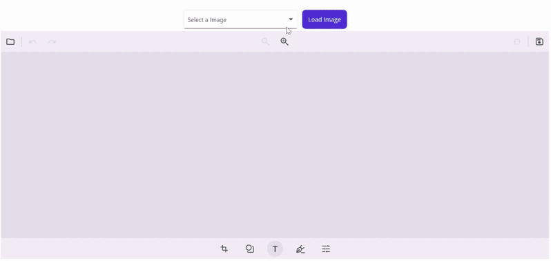

# Easy & Private Remote Image Handling for .NET MAUI ImageEditor

A compact, privacy-first pipeline to safely fetch, sanitize, and load remote images into Syncfusion® .NET MAUI ImageEditor using SkiaSharp. Handles corrupted data, EXIF privacy, memory limits, and cross-platform compatibility.

## Highlights
- Enforces file size and resolution limits to prevent excessive memory use  
- Validates file signatures (magic bytes) and Content-Type headers  
- Corrects EXIF orientation and strips metadata on re-encode (privacy)  
- Smart downscaling that preserves aspect ratio and quality  
- Produces ImageSource-compatible streams for direct use with Syncfusion ImageEditor

## Prerequisites
- .NET 8.0+  
- Visual Studio 2022 (17.8+) or VS Code  
- Syncfusion .NET MAUI ImageEditor (Community/Commercial)  
- SkiaSharp

## Quick Install
1. Clone:
   - git clone https://github.com/SyncfusionExamples/Easy-and-Efficient-Remote-Image-Handling-in-.NET-MAUI-Image-Editor.git
   - cd RemoteImageHandlingSample
2. Add packages:
   - dotnet add package Syncfusion.Maui.ImageEditor
   - dotnet add package SkiaSharp
   - dotnet add package SkiaSharp.Views.Maui.Controls
3. Register Syncfusion license in MauiProgram.cs:
   - Syncfusion.Licensing.SyncfusionLicenseProvider.RegisterLicense("YOUR_LICENSE_KEY");

## Key Components (API)
- CopyWithLimitedBytes(source, destination, MaxBytes, cancellationToken) — stream copy with byte limit  
- ValidatingFileSignatures(imageBytes) — magic-bytes validation for JPEG/PNG  
- ApplyOrientation(bitmap, encodedOrigin) — EXIF orientation correction  
- ImageResizing(bitmap, maxWidth, maxHeight) — quality-preserving downscale  
- ImageSanitizing(remoteStream, contentType, cancellationToken) — strips metadata and re-encodes

## Why Use This
- Security: Rejects malformed or malicious files before rendering  
- Performance: Predictable memory and improved load times  
- Privacy: Removes hidden EXIF data that can expose users  
- Compatibility: Works across iOS, Android, Windows, macOS

## Screenshort

## Resources
- Syncfusion ImageEditor docs: https://help.syncfusion.com/maui/imageeditor/getting-started  
- SkiaSharp: https://github.com/mono/SkiaSharp  
- .NET MAUI: https://dotnet.microsoft.com/apps/maui

## Support
For current Syncfusion customers, the newest version of Essential Studio is available from the [license and downloads page](https://www.syncfusion.com/Account/Login?ReturnUrl=%2faccount%2fdownloads). If you are not yet a customer, you can try our 30-day free [trial](https://www.syncfusion.com/downloads) to check out these new features. 

For questions, you can contact us through our support [forums](https://www.syncfusion.com/forums), [feedback portal](https://www.syncfusion.com/feedback), or support [portal](https://support.syncfusion.com/). We are always happy to assist you!

## Troubleshooting

### Path Too Long Exception

If you are facing a path too long exception when building this example project, close Visual Studio and rename the repository to short and build the project.

For a step-by-step procedure, refer to the link.
